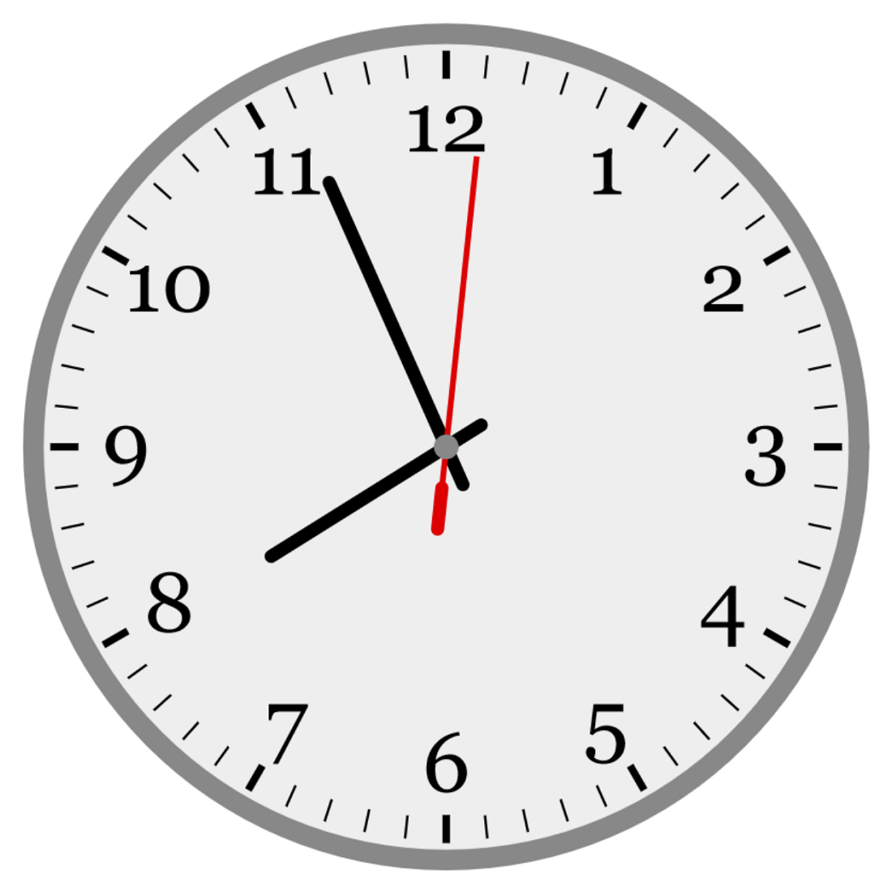

# Analog Clock

This example renders an analog clock that updates in real time.

It's a more complex drawing than other examples and uses a variety of canvas functions, as well as:

### `Effect`s

Because the `render` function runs in the `Effect` monad, it's able to call the `nowTime` function from `Effect.Now`.

### Scaling

The example uses a custom view box in `AppSpec`:

```purescript
  , viewBox: { x: 0.0, y: 0.0, width: 1100.0, height: 1100.0 }
```

In `render`, the clock is defined by a circle in the middle of the view box, and the position and radius are scaled to the canvas with the `to` scaling function:

```purescript
clock =
  { x: drawing.width / 2.0
  , y: drawing.height / 2.0
  , r: 500.0
  } `to` canvas
```

Some other values are scaled as well, like the thicknesses of the clock's hands:

```purescript
-- hour and minute hands
Canvas.setLineWidth context $ 16.0 `lengthTo` canvas

-- second hand
Canvas.setLineWidth context $ 7.0 `lengthTo` canvas
```

## Sample output

[See this example in action](https://smilack.github.io/purescript-gesso/examples/analog-clock/dist/)


