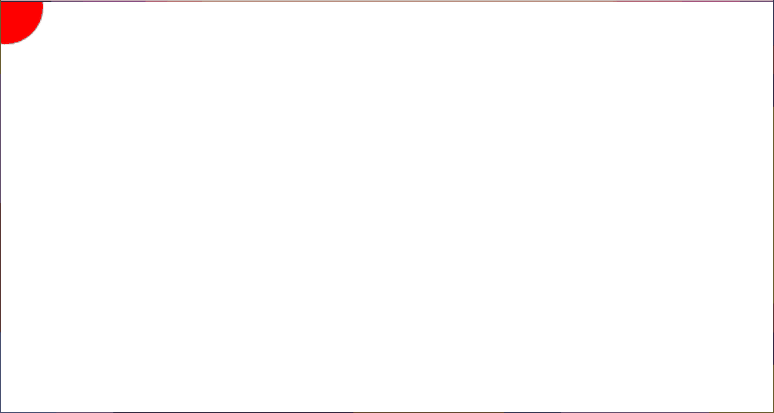

# Bounce

This example adds animation and state to an application. A red circle moves across the page, changing direction when it hits an edge.

### `update`

The update function moves the circle and may change its velocity depending on its position. It uses the `x`, `y`, `width`, and `height` properties of the `canvas` scaler to check the bounds of the canvas:

```purescript
update :: Delta -> Scalers -> State -> Effect (Maybe State)
update _ { canvas } { x, vx, y, vy } = pure $ Just $
  { x: x + vx'
  , vx: vx'
  , y: y + vy'
  , vy: vy'
  }
  where
  vx' = updateV x canvas.x (canvas.x + canvas.width) vx
  vy' = updateV y canvas.y (canvas.y + canvas.height) vy
```

This update is a pure function, but update functions run in `Effect`, so the new state is wrapped in `pure`.

To signal whether the state has changed, the new state is wrapped in a `Maybe` value with the `Just` constructor. If the function returned `Nothing` instead, this would tell Gesso to keep the state the same.

> [!IMPORTANT]
> The `Maybe` wrapper is important because the state type can be anything, and there are many types that can't be compared for equality.

### Rendering

The `render` function uses the `rect` property of the `canvas` scaler to clear the visible portion of the canvas:

```purescript
render :: Context2D -> Delta -> Scalers -> States State -> Effect Unit
render context _ { canvas } { current: { x, y } } = do
  Canvas.clearRect context canvas.rect
```

## Sample output

[See this example in action](https://smilack.github.io/purescript-gesso/examples/bounce/dist/)


