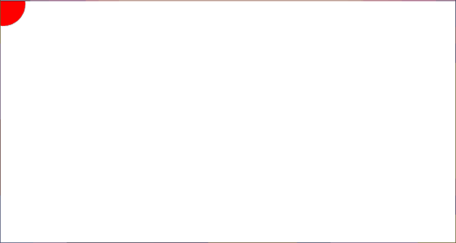

# Bouncing Ball

Bouncing Ball builds on the [Hello World example](../hello/README.md), adding animation and local state.

The imports in this example are still qualified, but aliased, unlike in the first tutorial. For example, `Gesso.Canvas` is now `GCan`.

## Output

[See this example in action](https://smilack.github.io/purescript-gesso/examples/bouncing-ball/dist/)



## The Code

The complete source for this example is located at [/examples/bouncing-ball/src/Main.purs](https://github.com/smilack/purescript-gesso/blob/master/examples/bouncing-ball/src/Main.purs).

### 1. Adding State

The first change we will make is to create a type for our state. This needs to keep track of where the ball is (`x` and `y` coordinates of the center) and what direction it's going (`vx` and `vy`). We will also put the size of the ball (`radius`) here too.

```purescript
type State =
  { x :: Number
  , vx :: Number
  , y :: Number
  , vy :: Number
  , radius :: Number
  }
```

To tell Gesso about the state, we will fill in the first type variable of the `Gesso.Canvas.Input` type and include our initial state in the `canvasInput` record:

```purescript
canvasInput :: forall i o. GCan.Input State i o
canvasInput =
  { name: "bouncing-ball"
  , localState: { x: 0.0, vx: 1.0, y: 0.0, vy: 1.0, radius: 25.0 }
```

The rest of our `canvasInput` is the same as the Hello World example, except for one more change in the `defaultApp` overrides: `update = GApp.pureUpdate update`

```purescript
  , app:
      GApp.defaultApp
        { window = GApp.fullscreen
        , render = render
        , update = GApp.pureUpdate update
        }
  , viewBox: GDims.p1080
  , interactions: GInt.default
  }
```

`GApp.pureUpdate` tells Gesso that our update function is pure - it doesn't have any side effects. If we needed to use `Effect`, we could use `GApp.effectUpdate` instead.

### 2. Updating

Our update function checks whether, at the current velocity, the ball would hit a wall, and if so, reverses the velocity.

```purescript
update :: GTime.Delta -> GDims.Scaler -> State -> Maybe State
update _ scale { x, vx, y, vy, radius } = Just { x: x + vx', vx: vx', y: y + vy', vy: vy', radius }
  where
  xMin = GDims.getX scale.screen

  xMax = xMin + GDims.getWidth scale.screen

  vx' = updateV x radius xMin xMax vx

  yMin = GDims.getY scale.screen

  yMax = yMin + GDims.getHeight scale.screen

  vy' = updateV y radius yMin yMax vy

updateV :: Number -> Number -> Number -> Number -> Number -> Number
updateV t r min max vt
  | t + r + vt > max = -1.0
  | t - r + vt < min = 1.0
  | otherwise = vt
```

Starting from the top, `update` takes a `Delta`, a `Scaler`, and the current `State`, and returns a `Maybe State`:

* `Delta` is a record that contains the current time and the time since the last frame. In this example, we're pretending every frame takes the same amount of time, so we're ignoring it.
* `Scaler` contains a bunch of functions for converting our coordinate system to and from the actual coordinates of the canvas - they might differ because of the way the canvas stretches with the window size.

```purescript
update :: GTime.Delta -> GDims.Scaler -> State -> Maybe State
update _ scale { x, vx, y, vy, radius } =
```

We return a *`Maybe`* `State` to tell Gesso whether the state needs to change: `Just something` if there are changes or `Nothing` if not. In this case we're always going to make changes, so our return value is:

```purescript
  Just { x: x + vx', vx: vx', y: y + vy', vy: vy', radius }
```

The apostrophes in `vx'` and `vy'` are pronounced "prime" and signify an updated version of a value. We calculate these in the `where` clause below. So, we're adding the new velocity to the old position to get the new position (since `distance = velocity * time`, but we're pretending all frames take the same time, we treat `time` as if it's `1`).

```purescript
  where
  xMin = GDims.getX scale.screen

  xMax = xMin + GDims.getWidth scale.screen
```

`scale.screen` is a `Gesso.Dimensions.ClientRect` which has a size and position. The `getX` and `getWidth` modules give use those values. This means `xMin` is the left edge of the screen and `xMax` is the left edge plus the whole width - meaning the right edge.

Lets jump down to `updateV` next:

```purescript
updateV :: Number -> Number -> Number -> Number -> Number -> Number
updateV position radius min max velocity
```

This function takes the position and radius of the ball, the minimum and maximum screen coordinates, and the current velocity.

If the current velocity would cause the ball to go past the maximum edge, make the velocity negative.

```purescript
  | position + radius + velocity > max = -1.0
```

If the current velocity would cause the ball to go past the minimum edge, make the velocity positive.

```purescript
  | position - radius + velocity < min = 1.0
```

Otherwise, don't change the velocity.

```purescript
  | otherwise = velocity
```

Back in `update`, we call `updateV` with the x-position, radius, left edge, right edge, and x-velocity in order to get the new x-velocity:

```purescript
  vx' = updateV x radius xMin xMax vx
```

That's the `vx'` we added to `x` in the return value of `update`. Next, we do the same thing again with the y-position and velocity:

```purescript
  yMin = GDims.getY scale.screen

  yMax = yMin + GDims.getHeight scale.screen

  vy' = updateV y radius yMin yMax vy
```

### 3. Rendering

```purescript
render :: State -> GTime.Delta -> GDims.Scaler -> Canvas.Context2D -> Effect Unit
render { x, y, radius } _ scale context = do
  Canvas.clearRect context (scale.toRectangle scale.screen)
  Canvas.setFillStyle context "red"
  Canvas.fillPath context do
    Canvas.arc context { x, y, radius, start: 0.0, end: 2.0 * pi }
```

Our render function also gets the `Delta`, `Scaler`, and `State`, but rendering happens after updating, so we'll be rendering the changes we just made in `update`. The `Context2D` is the Canvas's drawing surface and is an argument to `Canvas` functions.

First, we clear the Canvas so we don't leave a red trail:

```purescript
  Canvas.clearRect context (scale.toRectangle scale.screen)
```

Then, we set the fill color to red (Canvas has separate colors for *fill* and *stroke* - if we wanted an outline, we'd set that separately):

```purescript
  Canvas.setFillStyle context "red"
```

Circles are a little weird in `Context2D`. We have to start a path, draw an arc on the path, then color in the path. `fillPath` takes care of the first and last step.

The arguments to `arc` are the x and y coordinates of the center, the radius of the arc, and the start and end angles of the arc in radians. Without going into too much detail, a full circle starts at 0 and ends at 2π.

```purescript
  Canvas.fillPath context do
    Canvas.arc context { x, y, radius, start: 0.0, end: 2.0 * pi }
```

## Next Steps

The next example, [Controlling the Ball](../controlling-ball/README.md), introduces keyboard and mouse events.
