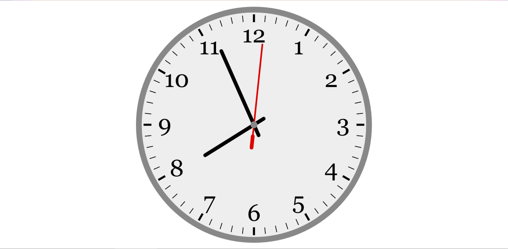

# Clock Example

Clock uses non-Canvas-related `Effect` functions in the `render` function to get the current time and display it as an analog clock. Everything happens in the render function, so there is no local state or update function.

This example was written before effectful update functions were possible; it would probably make more sense to get the time in an update function and only draw the clock in the render function.

## Output

[See this example in action](https://smilack.github.io/purescript-gesso/examples/clock/dist/)

