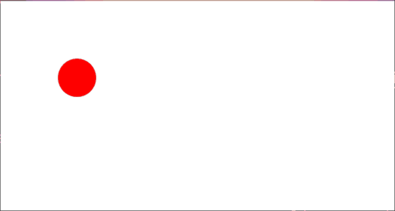

# Controlling the Ball

Controlling the Ball builds on the [Bouncing Ball example](../bouncing-ball/README.md), adding keyboard and mouse events.

The imports in this example are still qualified, but aliased, unlike in the first tutorial. For example, `Gesso.Canvas` is now `GCan`.

## Output

[See this example in action](https://smilack.github.io/purescript-gesso/examples/controlling-ball/dist/)

## The Code

The complete source for this example is located at [/examples/controlling-ball/src/Main.purs](https://github.com/smilack/purescript-gesso/blob/master/examples/controlling-ball/src/Main.purs).

### 1. Different State

### 2. Mouse Events

### 3. Keyboard Events

### 4. Fixing `update`