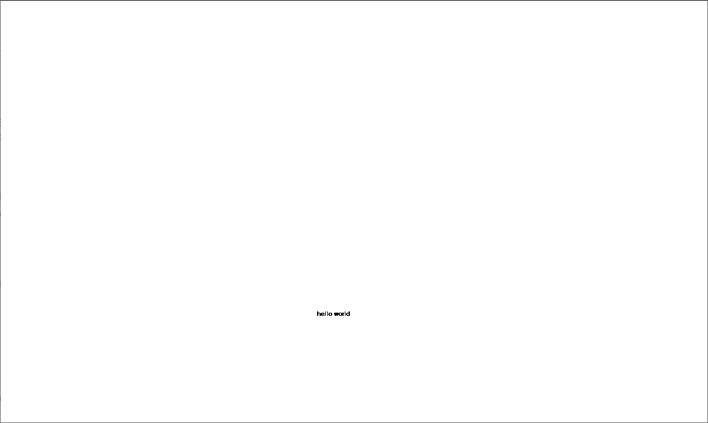

# Hello

This is the most minimal example of a Gesso application - a starting point for anything you might build.

### Configuration

The argument to `launch` is an `AppSpec` record. The Gesso manual has [a section covering `AppSpec` in detail](../../docs/manual.md#2-appspec).

Here, we use:

- `name` - the ID of our application - is `"hello"`
- `initialState` is `unit` because this application doesn't track any state
- the `viewBox` is [`null`](../../docs/manual.md#row-and-record-types), meaning we don't need a custom coordinate system for the drawing - we'll just use the dimensions of the canvas
- `window` is `Fullscreen`, so the canvas will take up the entire page
- in `behavior`, we overwrite the default `render` function with our function that draws the text `"hello world"`

## Sample output

[See this example in action](https://smilack.github.io/purescript-gesso/examples/hello/dist/)

