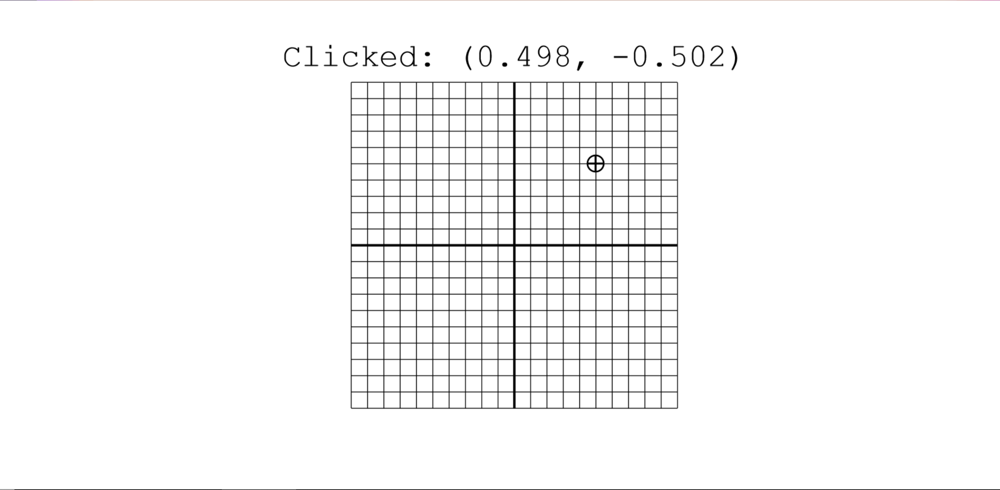

# Unit Grid Example

This example shows a grid from -1 to 1 on both the x and y axes, with lines at increments of 0.1. Clicking anywhere on the canvas places a crosshair and shows the coordinates of the spot clicked. The code may be interesting to look through because of the custom `viewBox` and frequent use of scaling functions.

## Output

[See this example in action](https://smilack.github.io/purescript-gesso/examples/unit-grid/dist/)

