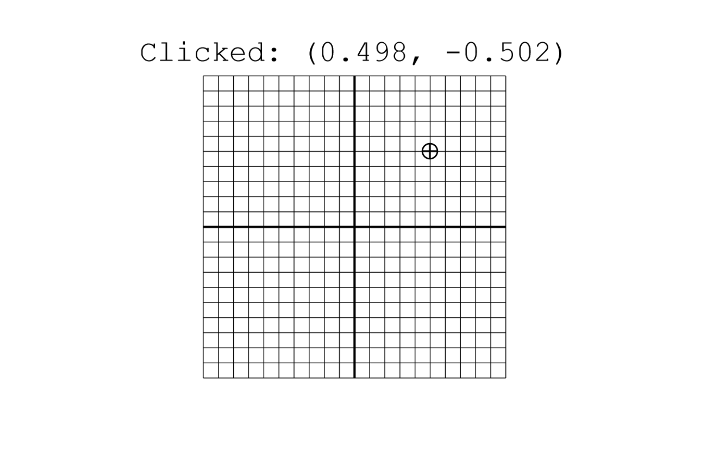

# Mouse and Scaling

This example shows a grid from `-1` to `1` on both the x and y axes, with lines at increments of `0.1`. Clicking anywhere on the canvas - in or out of the grid - places a crosshair and shows the coordinates of the spot clicked.

### View box

This example uses an unusual view box: ranging from `-1.5` to `1.5` on both axes:

```purescript
  , viewBox: { x: -1.5, y: -1.5, width: 3.0, height: 3.0 }
```

The grid occupies part of that: `-1` to `1` on both axes.

### Scaling

Clicking anywhere on the canvas displays the coordinates, from the drawing's perspective, of the clicked location. This includes areas outside of the view box: because the drawing scales to fit the canvas while maintaining its aspect ratio, there will be a margin either horizontally or vertically. The coordinates displayed are the location that the click would be if the view box extended infinitely in all directions.

Try clicking near the edges of the canvas to get a feel for the scaling.

The application stores the canvas coordinates of the clicked location, and converts them to drawing coordinates when rendering. Try clicking somewhere and resizing your browser window to watch the coordinates update as the scaling factors change.

### Interactions

This example uses `onMouseMove` and `onMouseDown` from `Gesso.Interactions` and `Gesso.Geometry.fromMouseEvent` to detect and track mouse events.

## Sample output

[See this example in action](https://smilack.github.io/purescript-gesso/examples/mouse-and-scaling/dist/)


