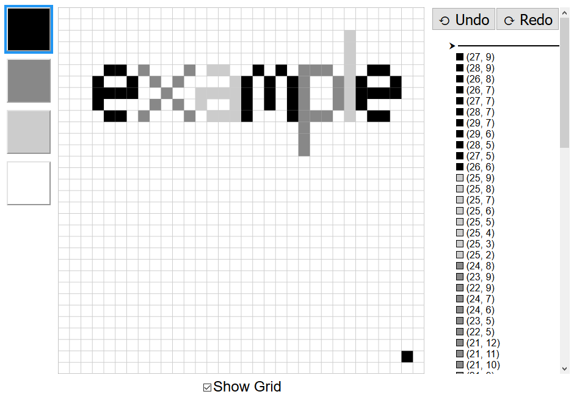

# Paint Example

The Paint example shows how to use a Gesso component inside a Halogen application. It uses Halogen queries to communicate with the parent component.

## Output

[See this example in action](https://smilack.github.io/purescript-gesso/examples/paint/dist/)

## The Code

The complete source for this example is located at [/examples/paint/src/Main.purs](https://github.com/smilack/purescript-gesso/blob/master/examples/paint/src/Main.purs).

### 1. Main

### 2. Component & Parent State

### 3. Slots

### 4. I/O