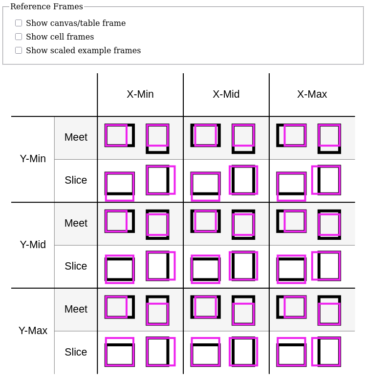

# Reference Frames

This example demonstrates creating and using reference frames to simplify coordinates, and scaling reference frames with [`preserveAspectRatio`](https://developer.mozilla.org/en-US/docs/Web/SVG/Reference/Attribute/preserveAspectRatio).

It also runs Gesso in a non-Halogen context using plain HTML elements as controls.

## Reference Frames and Aspect Ratios

Above the canvas, there are three checkboxes:

- Show canvas/table frame
- Show cell frames
- Show scaled example frames

Each one toggles showing or hiding a grid that highlights the coordinate systems described here.

### Canvas/table frame

The main portion of the drawing is a 4 × 4 table (including the headers), demonstrating the different combinations of:

- X-Min, X-Mid, X-Max
- Y-Min, Y-Mid, Y-Max
- Meet, Slice
- Landscape, portrait

In the view box of the drawing, each cell covers a 1 × 1 square.

### Cell frames

Inside each non-header cell, there is a 10 × 10 inner coordinate system that covers a 0.8 × 0.8 square centered in the cell.

Four rectangles are placed in the 10 × 10 grid (two 3 × 4 and two 4 × 3).

### Scaled example frames

Each of the four rectangles contains a 1 × 1 square scaled to fit inside it, using different combinations of aspect ratio parameters.

## Form Controls

This example uses `runGessoAff`, `awaitLoad`, and `selectElement`, which are [`Halogen.Aff`](https://pursuit.purescript.org/packages/purescript-halogen/7.0.0/docs/Halogen.Aff) functions, and `runUI` from [`Halogen.VDom.Driver`](https://pursuit.purescript.org/packages/purescript-halogen/7.0.0/docs/Halogen.VDom.Driver) to access the `HalogenIO` record returned by `runUI`.

```purescript
main :: Effect Unit
main = runGessoAff do
  awaitLoad
  container <- maybe err pure =<< selectElement (QuerySelector selector)
  app <- runUI Gesso.Canvas.component
    { name: "frames"
    , initialState
    , viewBox: { x: -2.1, y: -1.6, width: 4.2, height: 3.7 }
    , window: Fullscreen
    , behavior: defaultBehavior { render = render, input = handleInput }
    }
    container
  createControls \q -> app.query (CanvasInput q unit)
  where
  selector = "#frameExample"
  err = throwError $ error $ "Could not find " <> selector
```

It also uses [`purescript-web-events`](https://pursuit.purescript.org/packages/purescript-web-events/4.0.0) and [`purescript-web-html`](https://pursuit.purescript.org/packages/purescript-web-html/4.1.1) to create event listeners for the checkboxes and connect them to the `HalogenIO` record's `query` function.

```purescript
data InputType
  = DrawingGrid
  | CellGrids
  | ExampleGrids

createControls :: (InputType -> Aff (Maybe Unit)) -> Aff Unit
createControls query = do
  createControl (query DrawingGrid) "#drawingGrid"
  createControl (query CellGrids) "#cellGrids"
  createControl (query ExampleGrids) "#exampleGrids"

createControl :: Aff (Maybe Unit) -> String -> Aff Unit
createControl query sel = do
  mElement <- selectElement (QuerySelector sel)
  liftEffect case mElement of
    Nothing -> throwError $ error $ "Could not find " <> sel
    Just element -> do
      listener <- eventListener (handleEvent query)
      addEventListener (EventType "input") listener true (toEventTarget element)

handleEvent :: Aff (Maybe Unit) -> Event -> Effect Unit
handleEvent query _ = launchAff_ $ void query
```

## Sample Output

[See this example in action](https://smilack.github.io/purescript-gesso/examples/reference-frames/dist/)




